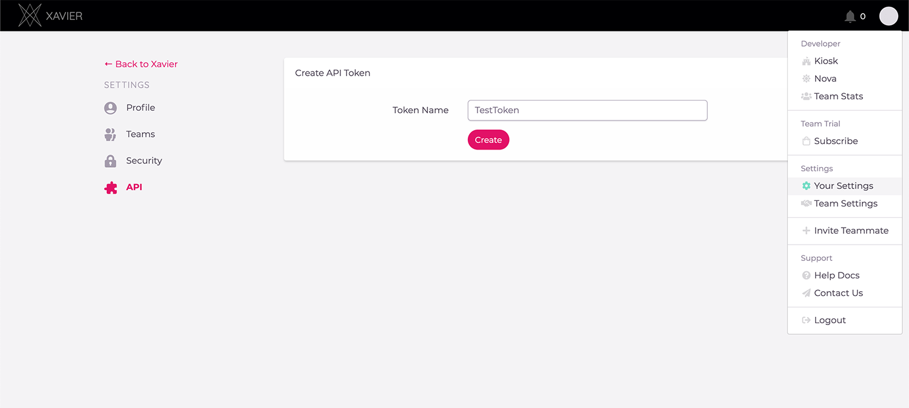
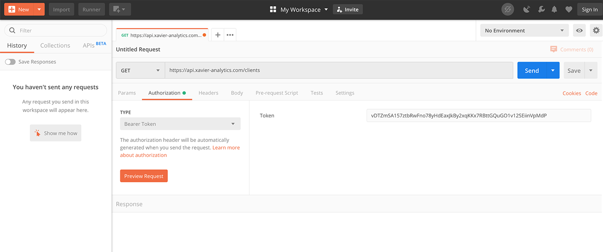

---

---
# API

Xavier offers an API to extract basic data about your organizations. If you would like to access to the API, please [get in touch](/contact-us.html).

::: warning
 Please note, our API is currently running in BETA phase. It may change in the future.
:::

## Getting Started

The current version of the API lives at: ```https://api.xavier-analytics.com/```

The easiest way to start using our API is by finding an HTTP client online. We would recommend using <a href="https://www.getpostman.com/downloads/">Postman</a>, or <a href="https://paw.cloud/">Paw</a> as they are ready-to-use, free tools.

In our demo we are going to use <a href="https://www.getpostman.com/downloads/">Postman</a>.

<!-- ### Versions:

| Versions        | Release Date   | Changes  |
| ------------- |:-------------:| -----|
| version 1.0 BETA      | 07/01/2020 | Initial deployment | -->

### Endpoints

| Endpoint        | What it does   |
| ------------- |:-------------:| -----|
| ```/clients```| Returns an array with a list of Clients|
| ```/clients/{clientId}```| Returns an array with a specific Client|

## Authentication

In order to get data out, you must pass an authorization token in the request header. To generate a token please use the following instructions:

**Request Header:** ```Authorization: Bearer <your token>```

In Xavier head to "Your Settings" and under the API tab generate your token.



Copy and store the given token in a safe place. Don't worry if you loose it, you can create a new one anytime.

Select _bearer token_ as your authentication method and copy your given token into the correct field. See below:



## API Calls

### GET /clients
***

Request: ```https://api.xavier-analytics.com/clients```

Response Content Type: application/JSON

Model:

```json
[
    {
        "id": "string",
        "name": "string",
        "healthScore": integer
    }
]
```
Example value:


### GET /clients/{clientId}

***

Request: ```https://api.xavier-analytics.com/clients/{clientId}```

Response Content Type: application/JSON

Model:

```json
[
    {
        "id": "string",
        "name": "string",
        "providerId": "string",
        "practiceCode": integer,
        "organisationType": "string",
        "healthScore": integer
    }
]
```
Example value:


## Responses

### 200 - OK
Indicates that the client's request was accepted successfully.

### 404 - Not found
The 404 error status code indicates that the API can't map the client's URI to a resource.

### 500 - Internal Server Error
500 is the generic API server side error response. Please [contact](/contact-us.html) our support team.
