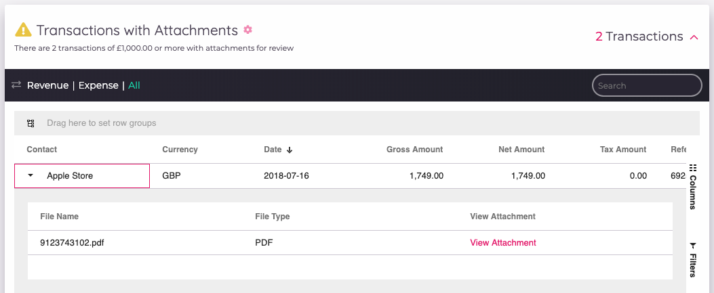
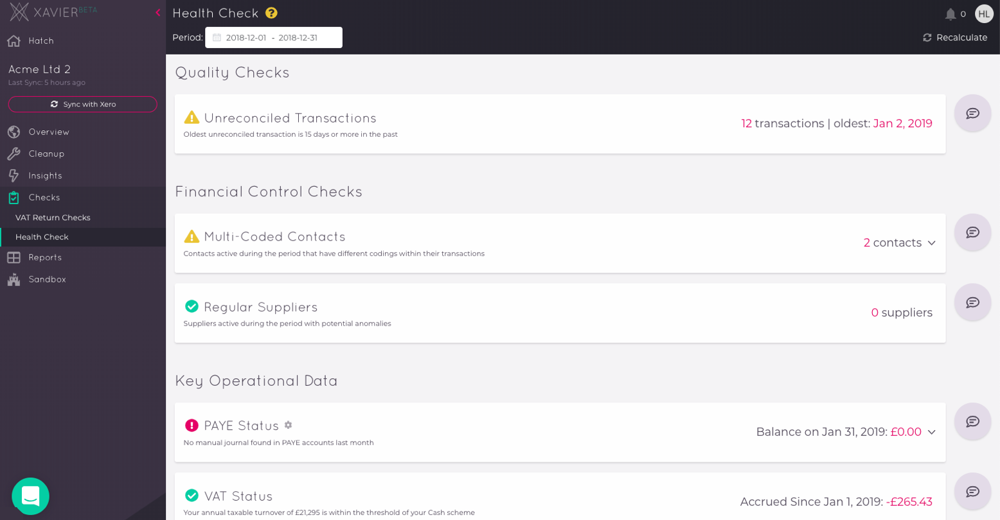

---
---

# Checks
Xavier has compiled a number of it's insights and cleanup tools, along with specialist calcuations, into one view
designed to fit into your practice processes. These checks have their own date filters that apply to the insights and
tools within, so you can run through them when the time calls. We call these *Checks*...

## VAT Return Checks
Xavier provides a set of checks that have been designed to quickly spot tax issues with respect to transaction data over
a given filing period. Simply enter in the date range and the minimum amounts (more on those below) and hit *Run Report*
to generate the checks. Expanding the card allows you to see these transactions, with a link directly to Xero to sort
them out.

These checks are called Tax Return Checks in regions outside the UK. We are working on building out functionality for other regions - so far we've added support for the South African 15% Two-Monthly VAT Scheme, and we have other regions also in development. 

### Scheme Thresholds (UK Only)
This check finds looks at annual and quarterly (where applicable) Taxable Turnover and makes sure that they are within
the limits of the selected VAT scheme [as defined by HMRC](https://www.gov.uk/vat-registration-thresholds). You'll see
a warning if the limits are within 10%, and an error if turnover has exceeded the limits.

### Estimated VAT (UK Only)

::: warning UK Customers Please Note:
Our VAT Checks work best when Xavier is connected with HMRC - without this connection, we cannot know when payments 
have been made or detect any late claims. Please see our [Integrations](https://help.xavier-analytics.com/integrations.html#hmrc-uk-only) section for more information.
:::
  
Xavier keeps a running estimate of VAT accrued (or due to be reclaimed) for the current period, it handles Cash, Accrual and Flat Rate schemes. 

Opening the card reveals further details, with a filter to display in HMRC VAT Return format, grouped by Vat "Box" Figures, or grouped by Tax Rate. 
You can also filter by current period or late claims.

If connected to HMRC, we are able to use actuals, which makes this estimation much more reliable.
  
### HMRC Status (UK Only) 

If you have connected to HMRC, our HMRC Status section provides details on the selected VAT period as well as upcoming dates for filing and 
payment status.

### VAT Control Account (UK Only)

If the HMRC integration is enabled, we can now reconcile the VAT Control Account in Xero against the current HMRC 
liabilities, plus any accrued VAT and future VAT (if on the Cash scheme), to ensure this account balances. The balance is 
also available at a glance in the [Practice Dashboard](https://help.xavier-analytics.com/sandbox-reporting.html#practice-analysis).

### Unreconciled Transactions
This uses the same logic as the [Unreconciled Transactions](/insights.html#unreconciled-transactions) insight to find
unreconciled transactions for the date range you have supplied.

### Revenue Account Review
This check finds transactions that don't have an Account Class of REVENUE, but have been assigned as revenue Tax Type of
OUTPUT2, RROUTPUT or ZERORATEDOUTPUT.

### Expense Account Review
This check finds expense transactions that have been assigned a Tax Type of INPUT2 (20% VAT on Expenses), with accounts
that have [Reporting Codes](https://central.xero.com/s/article/Report-codes-for-practices-using-report-templates) of
EXP.ADM.ENT (Entertainment), EXP.ADM.PRI (Printing & Postage) or EXP.ADM.TRA (Travel International).

### Balance Sheet Review
This check finds ASSET, LIABILITY or EQUITY type transactions with a non-zero tax value, excluding Fixed Assets (account
type FIXED) and Reporting Codes of LIA.CUR.ACC (income in advance) or ASS.CUR.REC.PRE (prepayments).

### 20% VAT Review
This check finds transactions with a tax type of either 20% VAT on Income or 20% VAT on Expenses with a net value above
the minimum amount set by you in the configuration for this check.

### Zero-Rated Review
This check finds transactions with a tax type of ZERORATEDINPUT with a net value above the minimum amount set by you in
the report header (*Zero Rated Min*). The idea here is to ensure the client is claiming back VAT on as many high value
items as possible.

### No-VAT Review
This check finds transactions with a tax type of NONE with a net value above the minimum amount set by you in
the report header (*No VAT Min*).

### Multi-coded Contacts
The same as the [Multi-Coded Contacts](/insights.html#multi-coded-contacts) insight, but looking at contacts that
have transactions in the reporting period specified.

### Transactions Without Attachments
This check finds transactions that are lacking attachments (useful from a VAT evidence point of view), with a net value
above the minimum amount set by you in the popup configuration (click the little cog beside the title to set the minimum
value). Clicking the card shows the list of transactions, which you can filter by Revenue or Expense.

### Transactions With Attachments
This check allows you to review transactions that do have attachments, with a net value above the minimum amount set by
you in the popup configuration (click the little cog beside the title to set the minimum value). Clicking the card shows
the list of transactions, which you can filter by Revenue or Expense. Clicking the plus beside the Contact Name in a
transaction row will expand to show a list of attachments relating to that transaction. For each attachment listed, you
can click "View Attachment" which will open the attachment in another browser tab, or download it, depending on the file
type:

## Health Check
The health check is designed for practices to run through on a regular basis with their clients, ensuring that the books
are kept clean and providing value to the client. The process hits a number of touch points to make sure clients are
financially prepared as well as highlighting any issues before they become a real problem.

Simply enter in the date range and hit *Recalculate* to generate the checks.

The traffic light system tells you which checks require attention. Key stats are displayed at a glance, and you can
click to expand the card and see more detail or head through to the actual insight.

Clicking the *speech bubble* beside each card will toggle to display some narrative around the purpose of the check, and
how to approach it with your client. You can click the speech bubble again to close it.

### Unreconciled Transactions
This uses the same logic as the [Unreconciled Transactions](/insights.html#unreconciled-transactions) insight to find
unreconciled transactions for the date range you have supplied, and the age of the oldest unreconciled transaction. The
indicator will be amber if there are unreconciled transactions over 15 days old, and red for if there are any over 30
days old.

### Fixed Assets
The same as the [Fixed Assets](/insights.html#fixed-assets) insight, but using the end date specified in the Health
Check as the fixed asset _Reporting Date_.

### Dormant Accounts
The same as the [Dormant Accounts](/insights.html#dormant-accounts) cleanup tool, but using 2 years before the end date
specified in the Health Check as the _Dormant Since_ date.

### Aged Balances
The same as the [Aged Balances](/insights.html#aged-balances) insight, but using the end date specified in the Health
Check as the Aged Balances _Reporting Date_. The _Invoice Age_ is fixed to 3 months from the end of the Health Check
period.

### Draft Invoices
This check looks for invoices that have a status of either _DRAFT_ or _SUBMITTED_ (Awaiting Approval) and have an
invoice date that is before the end of the reporting period. Ideally these should be dealt with before the period is
closed off.

### Entertainment Accounts
The purpose of this check is to highlight entertainment expenditure across two categories, Staff and Business, each of
which have different tax rules. __Note:__ this requires some manual configuration per client to report correctly. The
default configuration uses the Xero Reporting Code _EXP.ADM.ENT_ to try and summarise entertainment expenditure in
general.

You can change the configuration by clicking the small cog next to the Entertainment Accounts title.
Clicking on the Staff Entertainment or Business Entertainment cards will expand to allow you to review the relevant
transaction history.

- __Staff Entertainment__: once the number of employees and the account codes for staff entertainment have been set, this check shows the spend
per person since the start of the current UK tax year. Warnings or errors are displayed as the spend per person
approaches or exceeds the current HMRC allowable limit of £150.

- __Business Entertainment__: This check summarises the expenditure during the Health Check _Reporting Period_ for the account codes specified as
Business Entertainment. As VAT cannot be reclaimed on this expenditure, this is also summarised for review.

__Note:__ the rules around staff entertainment are specific to UK tax at present.

### Multi-coded Contacts
The same as the [Multi-Coded Contacts](/insights.html#multi-coded-contacts) insight, but looking at contacts that
have transactions in the reporting period specified.

### Regular Suppliers
The same as the [Regular Suppliers](/insights.html#regular-suppliers) insight, but looking at suppliers active during
that period with potential anomalies.

### PAYE Status
This check balances manual journals against detected payments with PAYE account codes to ensure a correct PAYE status at
a point in time.
By default, the check calculates the PAYE control account balance based on account codes found under the reporting code
*LIA.CUR.TAX.OTH*. You can change the account codes used by clicking the small cog next to the card title. Expanding the
card shows the detailed grid of PAYE transaction history for the last 6 months.

The PAYE check runs through the following logic:
- All is well: if the Control Account balance is 0 and there is a Manual or Xero Payroll Journal present in the last
complete month
- All is well: the Control Account balance is equal to the amount posted in the Manual or Xero Payroll Journal(s) in the
last complete month, and the snapshot date is well in advance of the HMRC Deadline
- Warning: Contol Account and Journals balance, but HMRC payment due date is approaching
- Error: No Manual or Xero Payroll Journal found in the last complete month
- Error: No payment detected, and HMRC payment deadline is past due
- Error: Control Account balance is non-zero and does not reconcile with balance of Manual or Xero Payroll journals

### VAT Status
A summary of the [VAT Tracking](/insights.html#vat-tracking) insight reporting on the VAT accrued since the start of the period, and
if the annual taxable turnover is within the threshold of your detected scheme.

### Estimated Corporation Tax
A summary of the [Corporation Tax](/insights.html#corporation-tax) insight, sharing the next estimated payment for the
previous period, and the estimated corporation tax accrued for the current period.

### Dividends Status
This check shows a running tally of the dividends posted in the system since the start of the client's current financial
year. The point of this check is to ensure that dividends are declared where necessary from an audit trail perspecitve,
and that these intended funds are not being distributed via other channels.

By default, the check retrieves the balance of each control account based on account codes found under the reporting
code *EQU.RET.DIV*. You can change the account codes used by clicking the small cog next to the card title. Expanding
the card shows a balance for each of the dividend accounts found. Clicking on a dividend account will display a detailed
grid of its transaction history since the start of the financial year.

In terms of status, the Dividends check will show a warning if it is greater than 3 months into the client's financial
year and no evidence of dividends declaration has been found.
