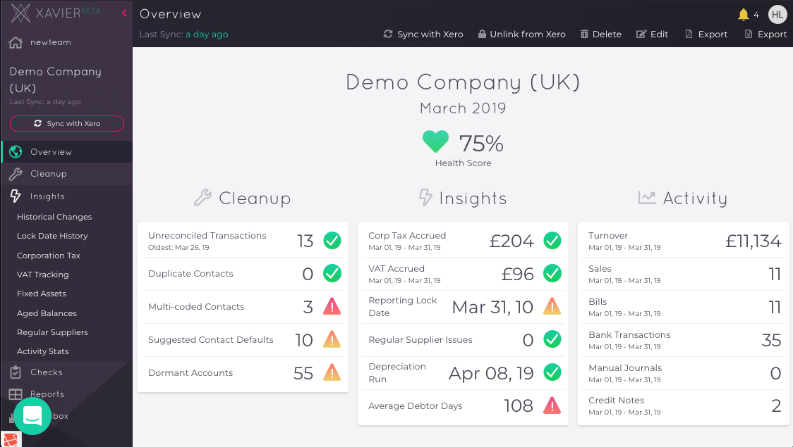

# Client Views
Clicking on a client card from the home page will take you through to the management of that specific client.

## Overview

In addition to providing high level stats about a client, the overview is where you can manage a client, 
adjusting specific aspects from the *Edit* button, removing it from Xavier via the *Delete* button and un-linking it from
Xero using the *Unlink* button. 

Unlinking a client from Xero means it will remain in Xavier, but will no longer sync with Xero to retrieve the latest 
changes. A client can be re-linked to Xero at any point, and syncing will resume.  

[Syncing with Xero](/xero-integration.md#syncing) happens automatically overnight, but you can also trigger a sync on-demand via the *Sync Now* button. 

This view also highlights any issues with the client's Lock Dates - [find out more](/team-management.md#lock-dates).

## Sandbox

## Reports

## Insights

### Multi-Coded Contacts

Each Invoice and Bank Transaction line item is assigned an Account Code and a Tax Code in Xero. 
The majority of the time, these codes *should* be consistent for a given supplier or customer. 

It happens to be best of us though - sometimes these records are assigned the wrong codes, or coding evolves over time.
We’ve crunched the numbers to find these potential mis-codings and you'll them presented in this insight, with helpful 
links directly to Xero allowing you to amend these where needed. 

Xero provides a dedicated mechanism for re-coding, and their support documentation on this is [here](https://central.xero.com/s/article/Find-Recode-a-group-of-transaction-lines).