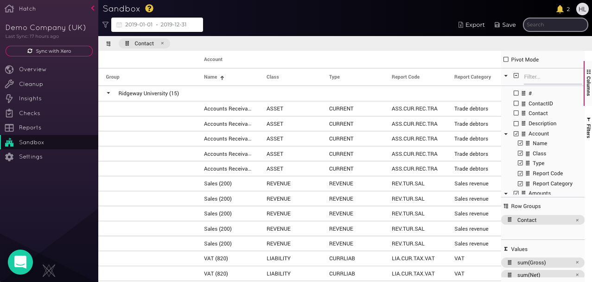
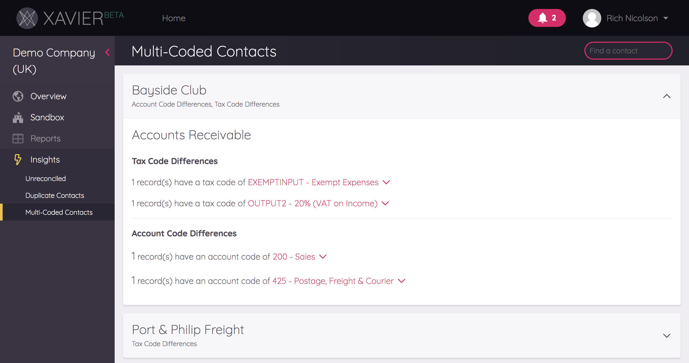

# Client Views
Clicking on a client card from the home page will take you through to the management of that specific client.

## Overview

In addition to providing high level stats about a client, the overview is where you can manage a client, 
adjusting specific aspects from the *Edit* button, removing it from Xavier via the *Delete* button and un-linking it from
Xero using the *Unlink* button. 

Unlinking a client from Xero means it will remain in Xavier, but will no longer sync with Xero to retrieve the latest 
changes. A client can be re-linked to Xero at any point, and syncing will resume.  

[Syncing with Xero](/xero-integration.md#syncing) happens automatically overnight, but you can also trigger a sync on-demand 
via the *Sync Now* button. 

This view also highlights any issues with the client's Lock Dates - [find out more](/team-management.md#lock-dates).

## Sandbox
The Sandbox is your data playground, a place where your KPI hopes and dreams can come to life. 

### The Sandbox Data
We start with Xero's Journal Line Items as a base, and supplement each record with additional data based on the type of 
journal it is - be it an Invoice, and Bank Transaction, a Credit Note and so on. We also bring in Contact and Account 
information so you've got all the key information you need in one place.  

### Customising the Sandbox
The sandbox is a drag and drop report-builder, with spreadsheet-like functionality, right in your browser. And if you're
a fan of Excel's pivot tables, you'll find that too. You can choose the columns you want to see, group-by, sort, collapse 
and expand until you get it just how you want. In the image below the sandbox has been customised to group by Contact, 
sort by Gross Amount and hide some columns. 

Interested in the tech? Behind the scenes we've integrated [ag-Grid's amazing data tables framework](https://www.ag-grid.com/), 
which provides the enterprise-grade pivot table functionality.   

### Saving as a Custom Report
You can save sandbox configurations as a custom report.

## Reports

## Insights
In addition to allowing you to slice and dice your Client data, Xavier applies a number of its own data analysis
techniques and presents the findings up as *Insights*...

### Unreconciled Transactions
*Coming Soon*

### Duplicate Contacts
*Coming Soon*

### Multi-Coded Contacts

Each Invoice and Bank Transaction line item is assigned an Account Code and a Tax Code in Xero. 
The majority of the time, these codes *should* be consistent for a given supplier or customer. 

It happens to be best of us though - sometimes these records are assigned the wrong codes, or coding evolves over time.
We’ve crunched the numbers to find these potential mis-codings and you'll them presented in this insight, with helpful 
links directly to Xero allowing you to amend these where needed. 

Xero provides a dedicated mechanism for re-coding, and their support documentation on this is [here](https://central.xero.com/s/article/Find-Recode-a-group-of-transaction-lines).