# Insights
In addition to allowing you to slice and dice your Client data, Xavier applies a number of its own data analysis
techniques and presents the findings up as *Insights*...

## Unreconciled Transactions

Xavier lets you view a client's unreconciled bank transactions. It uses Xero's Bank Statement Report data to do so.
From each record, you can click straight into Xero to start the reconciliation process. This insight allows you to
quickly order by the oldest records (useful if you are approaching month end), and also see/filter/group the records
that are in a "locked" period.

You can also hit the *View All Items* button at the top of the insight to work with all bank statement records, not just
the unreconciled ones.

Xero guidance on bank reconciliation can be found [here](https://central.xero.com/s/article/Bank-reconciliation-in-Xero).

## Duplicate Contacts

The results shown in this Xavier insight are your Xero contacts that we’ve identified as potential duplicates.
This can happen if you create a new contact during the process of inputting an invoice or similar, and miss the fact that
the contact already exists.

Review these, you may dismiss any which aren't true duplicates, or clicking the name of the contact will take you to Xero to amend them. The transaction count should give a good indication of which contact has had more activity.

Xero guidance on merging contacts can be found [here](https://central.xero.com/s/article/Edit-or-merge-an-existing-contact).

## Multi-Coded Contacts
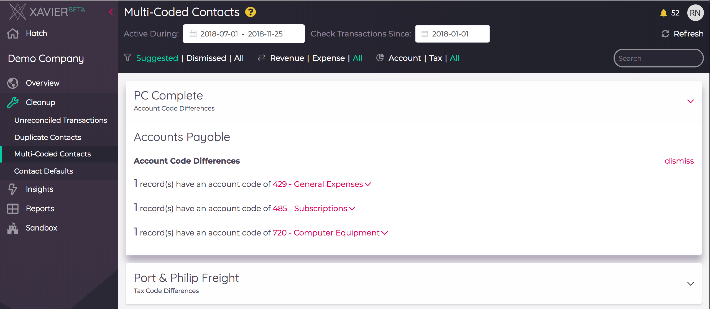

Each Invoice and Bank Transaction line item is assigned an Account Code and a Tax Code in Xero.
The majority of the time, these codes *should* be consistent for a given supplier or customer.

It happens to be best of us though - sometimes these records are assigned the wrong codes, or coding evolves over time.
We’ve crunched the numbers to find these potential mis-codings and you'll see them presented in this insight, with helpful
links directly to Xero allowing you to amend these where needed.

Xero provides a dedicated mechanism for re-coding, and their support documentation on this is
[here](https://central.xero.com/s/article/Find-Recode-a-group-of-transaction-lines).

### Selecting The Date Filters
The Multi-Coded Contacts insight allows you to specify two different date filters:

**Active During**: This is the period where you want to find contacts to assess. Xavier will find and evaluate contacts
that have been active (i.e. they have transactions) during this time period. For example, this could be your reporting
period of the previous month.

**Check Transactions Since**: Once Xavier finds the active contacts to evaluate, this date refers to how far back in
time Xavier should look into each Contact's transaction history to compare account and tax codes and surface any
inconsistencies. For example, if you know that you changed your accounts structure at the start of the year, it doesn't
make sense to evaluate transaction history before the change, so set this date to be the 1st of January (or whenever
you made the change).

### Narrowing The Scope
The Multi-Coded Contacts insight allows you to get really targeted with the data cleanup process, and quickly filter out 
any suggestions that don't make sense for your situation.

**Revenue | Expense | All**: Restrict the suggestions list to only transactions relating to Revenue OR Expenses.
  
**Account | Tax | All**: Restrict the suggestions list to only transactions Xavier has identified with Account Code 
anomalies, OR Tax Code anomalies.

### Understanding the Colour-Coding
Xavier adds colour to the transaction rows to provide a clear indication as to which transactions fall into the "Active
During" period and which ones are historical:

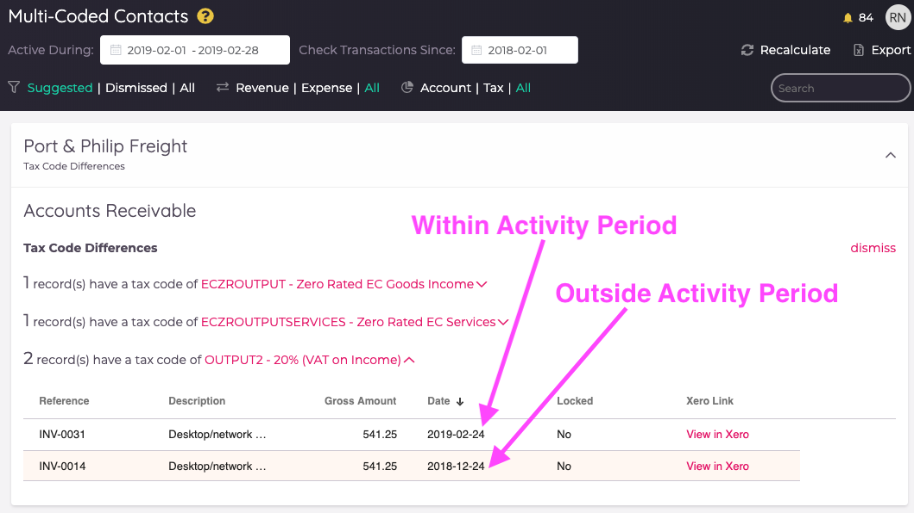

## Contact Defaults
Contacts in Xero can be setup with "default" account codes for sales and purchases. If set, Xero will use these to
pre-populate the account code fields during bank statement reconciliation. For contacts that your client has
a recurring relationship with (e.g. a supplier that bills monthly), setting these defaults in Xero can dramatically
speed up the reconciliation process:

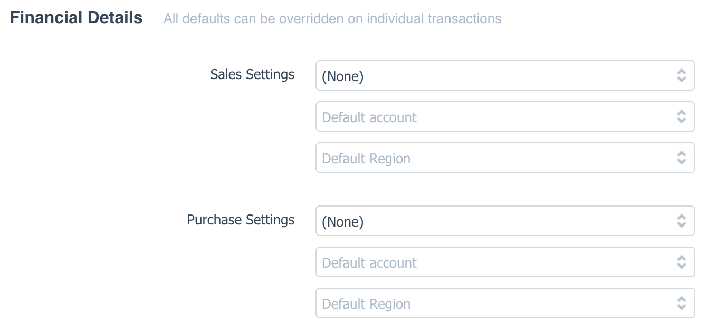

Figuring out what contacts are eligible for setting up a default code in Xero can be time consuming. This Xavier system
analyses each contact's transaction history and searches for contacts where either sales or purchase invoices have been
consistently assigned the same account code, and presents these up to you in a handy list:

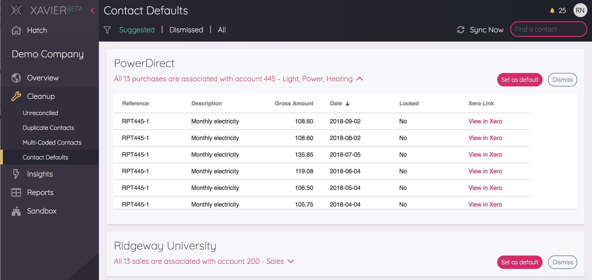

You can review the transaction history of these contacts and decide whether or not to apply Xavier's suggestion.

Dismissing the suggestion will hide it from the "Suggested" list, but you can always undo this from the "Dismissed" list if
you want it back.

Clicking *Set as default* does what is says on the tin - Xavier will prompt you to confirm before setting the suggested
account code in Xero as the default for either Sales or Purchases:

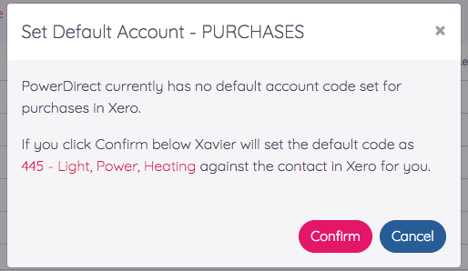

Xero's support documentation on settings for Contacts is [here](https://central.xero.com/s/article/What-are-contacts-in-Xero-UK).

## Dormant Accounts
This view identifies GL Accounts that have not had any transactional activity recorded against them from the "Dormant
Since" date you supply.

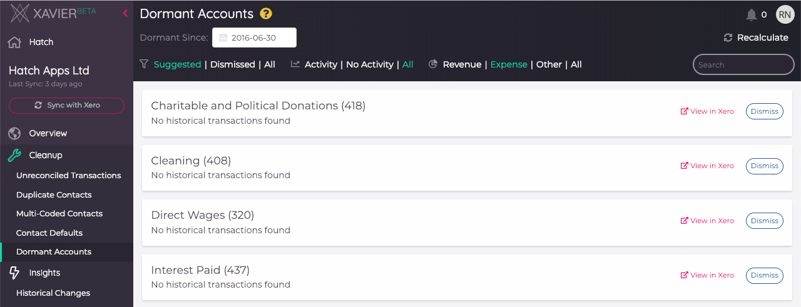

You can review the transaction history of these accounts and decide whether or not to take action on Xavier's suggestion.
The idea is to help you identify old account codes that could be cleaned up, either through archiving or deleting, for
better reporting. 

You can filter and sort to look at accounts with transactional history (activity) and also by Account Class. Xavier
won't show you Xero System Accounts as they cannot be archived.

For each account found, you can follow the link to Xero's Chart of Accounts to archive or delete the account, or you can 
dismiss it. Dismissing the suggestion will hide it from the "Suggested" list, but you can always undo this from the 
"Dismissed" list if you want it back.

Read more on
[managing account codes in Xero](https://central.xero.com/s/article/Delete-archive-or-restore-an-account-in-your-chart-of-accounts). 

## Corporation Tax
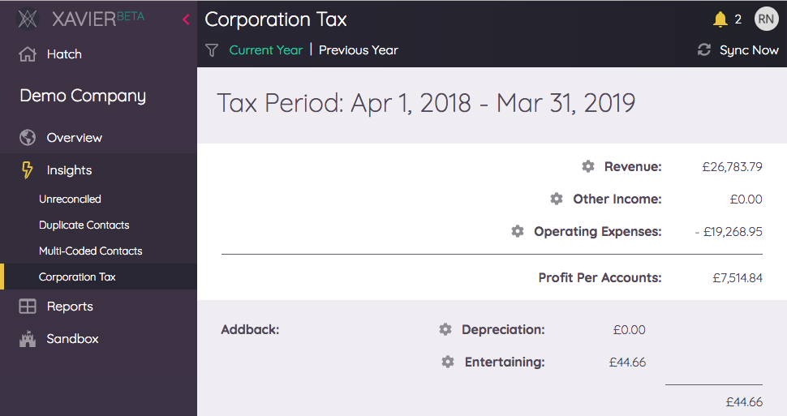

The Corporation Tax insight gives an estimate of the corporation tax accrued by a company for the current and previous
financial years, based on UK tax rates and using the financial year-end dates in the Xero settings.

In terms of how the different elements are calculated, Xavier starts your team off with some defaults based on the chart
of account's [Account Type](https://central.xero.com/s/article/Components-of-an-account-in-your-chart-of-accounts-AU?userregion=true)
and the  [Reporting Codes](https://central.xero.com/s/article/Report-codes-for-practices-using-report-templates)
provided by Xero.

### Client-specific configuration
Reporting Codes are applied to all Accounts, and can be customised in Xero by your team. They are a great way of
achieving reporting consistency across clients that have different chart of account configurations. But you only have
visibility of Reporting Codes if you are a Xero Partner, and sometimes it is not feasible to configure these for every
client you work with.

Xavier allows you to override the default corporation tax calculation for a client. By clicking on the cog beside an
element of the corporation tax view you will see what is currently being used for that section of the calculation.

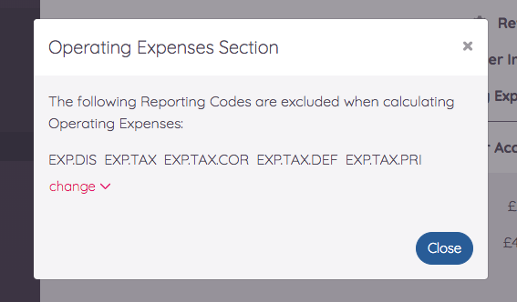

Clicking "change" allows you to specify individual account codes to either include or exclude, depending on the section:

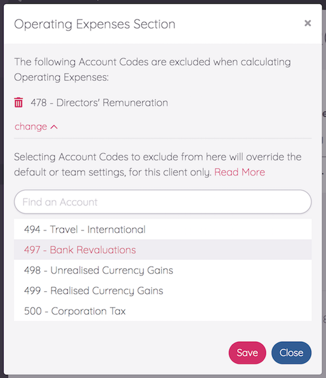

Specifying account codes means that the default calculation will no longer be used for this client, and Xavier will
instead use the account codes provided. Upon clicking *Save*, the corporation tax will be recalculated for current and
previous years based on the new configuration.

You can remove account codes from the calculation at any time, and removing all of them will result in the calculation
reverting back to using the Xavier defaults.

## VAT Tracking
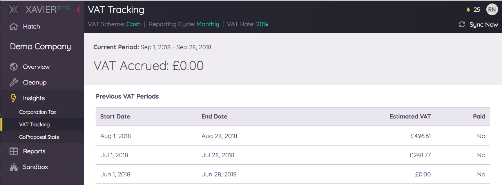

The VAT Tracking insight gives an estimate of the VAT accrued by a company for the current VAT period, and includes
estimates for previous periods dating back to the end of the previous financial year. The financial year and VAT periods
are based on the client's settings in Xero.

### Cash vs Accrual Schemes
In the UK, a company could be configured to report VAT to HMRC on a Cash basis or an Accrual basis. Xavier automatically
detects this based on Xero settings and adjusts the VAT calculation accordingly.

### Flat Rate Scheme
Xavier will detect if a client is on a [Flat Rate Scheme](https://www.gov.uk/vat-flat-rate-scheme/how-much-you-pay), but
it has no way of knowing what VAT rate has been agreed with HMRC for the client. The first time you view the VAT Tracking
insight, Xavier will prompt for the VAT rate to use if it detects the client is on a Flat Rate Scheme:

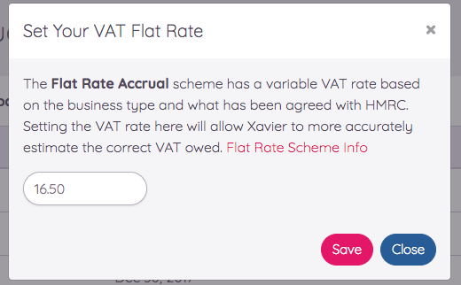

You can adjust this for a client at any time by clicking on *Adjust Rate* in the menu bar of the VAT view.

### Scheme Thresholds
For the Cash and Flat Rate schemes, Xavier monitors your
[taxable turnover](https://www.gov.uk/vat-registration/calculate-turnover) to ensure that you remain on the right
scheme from a compliance perspective, using HMRC's defined [thresholds](https://www.gov.uk/vat-registration-thresholds).

For example, you'll get an alert at the top of the VAT insight if you exceed a threshold:

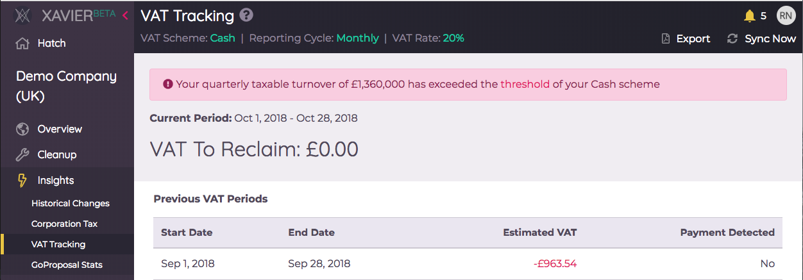

And similarly Xavier also warns you if you are approaching a threshold:

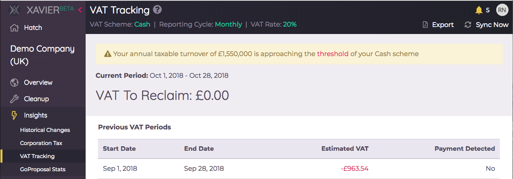

### Payment Detection
Xavier will try and detect if a previous period's accrued VAT has been paid to HMRC or not, by searching for reconciled
bank transactions within 6 months of the end of the period, with:
- a GL Account with the Reporting Code of `LIA.CUR.TAX.VAT`
- a payment amount within a 2% variance of the estimated amount for the period

If such a payment is found, the *Payment Detected* field will be set to "Yes". Clicking on this will take you straight
through to the bank transaction in Xero.

## Fixed Assets
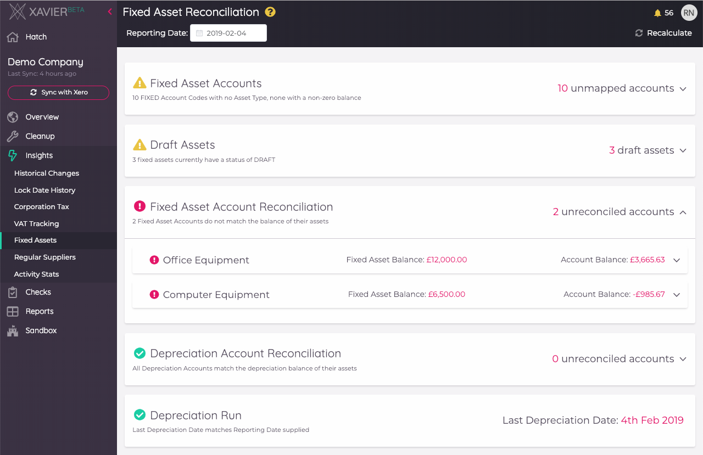

Fixed Assets are a somewhat separate part of the Xero system, which can lead to some inconsistencies. Xavier connects to
the Fixed Assets register in Xero and compares it with the general accounting ledger to highlight where records may be
out of sync.

### Fixed Asset Accounts
Xavier looks at general ledger Accounts that have an Account Type of _FIXED_, and then looks for mapped Asset
Types in the Fixed Asset register. Accounts need to be selected as the Fixed Asset Account, Depreciation Expense Account
or Accumulated Depreciation Account of at least one Asset Type to be considered "mapped". 

Xavier then checks the balance of any unmapped Accounts - if any are non-zero then this should be considered a genuine 
issue that needs immediate attention.   

### Draft Assets
Xavier searches the fixed asset register for draft assets and lists them here for convenience. This section is a good
place to start if the asset types are not reconciling in the section above.

### Fixed Asset Account Reconciliation
This section cycles through all of the accounts in Xero's general ledger that are specified as the *Fixed Asset Account*
in the Fixed Assets register. It  compares their balance with the combined totals of the *Purchase Price* of all assets
associated with it, up to the Reporting Date, and highlights any that don't match. You can expand
each Asset type to compare transaction history of the Account with the Asset activity. 

### Depreciation Account Reconciliation
Similar in logic to the Fixed Asset Account Reconciliation, this section cycles through all of the accounts in Xero's 
general ledger that are specified as the *Accumulated Depreciation Account* in the Fixed Assets register. It  compares
their balance with the combined totals of the "Depreciation Value" of all assets associated with it, up to the Reporting
Date, and highlights any that don't match. The Depreciation Value is a calculation of the difference between the 
*Purchase Price* and *Accounting Book Value* of an asset.  

### Depreciation Run
This simple check compares the Reporting Period specified at the top of the insight with the "Last Depreciation Date" in
the Fixed Asset Register, and shows an error if they don't match.

## Aged Balances
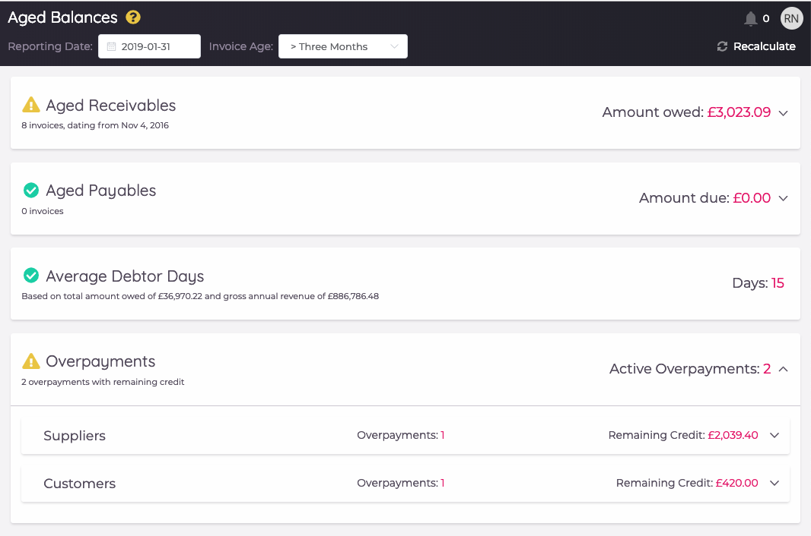

The Aged Balances insight looks at aged Debtors and Creditors (i.e. old invoices) at a snapshot in time.

### Setting Parameters
- **Reporting Date**: this is the point in time that you want to evaluate your debtors and creditors at, based on invoice
dates.
- **Invoice Age**: the age of the invoice in relation to the _Reporting Date_. For example, setting the _Invoice Age_ to
two months means Xavier will only look at invoices that are dated older than two months from the Reporting Date.

### Aged Receivables
This surfaces your debtors, old invoices for people that owe you money. You can see a count of old invoices at a glance
and a sum of the total amount owed. Clicking on this card will expand to show the detail of each aged invoice, each with
a link straight to Xero if needed.

### Aged Payables
This surfaces your creditors, old invoices for people that you owe money to. You can see a count of old invoices at a 
glance and a sum of the total amount you owe. Clicking on this card will expand to show the detail of each aged invoice,
each with a link straight to Xero if needed.

### Average Debtor Days
This uses a common ratio-based method to provide an indication of the length of time it takes for your debtors to pay 
you. This is based on the total Receivable amount owed at the _Reporting Date_, and the gross revenue over the last 12
months up to the _Reporting Date_.

### Overpayments
The check allows you to review all overpayments that still have remaining credit available at the time of the
_Reporting Date_, by checking the dates of any allocations to make sure they are applicable. This is categorised into
Overpayments relating to Suppliers and Customers.     

## Activity Stats

Designed for accountancy firms utilising proposal tools such as [GoProposal](https://goproposal.com/) to determine 
pricing for their clients, the _Activity Stats_ insight gives a breakdown of the key trading statistics of a company, 
with a focus on volume, e.g. number of bank transactions for the period. These figures can then be input directly into 
your proposal tool to quickly calculate pricing when a client is up for renewal.

By default, this insight calculates statistics for a rolling 12 month period, starting from the last complete month, and
working back from there. However, you can select a date range and Xavier will do its best to segment your date range
into monthly slots.

### Understanding Turnover
The Activity Stats insight uses the following logic to determine the Turnover calculation:

The _NET_ value of all transactions in the selected date range that have an __Account Type__ of either _Revenue_ or
_Sales_.

::: tip
Note that the Account Type _Other Income_ is not included in this calculation.
:::

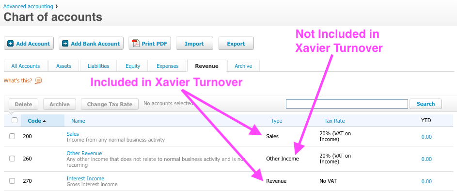   

This gives you some flexibility in determining this Turnover figure, as the Account Type can be modified for each 
account in Xero. 

::: tip
Xero provide some documentation on working with
[Chart of Accounts](https://central.xero.com/s/article/Chart-of-accounts-in-Xero).
:::

## Historical Changes
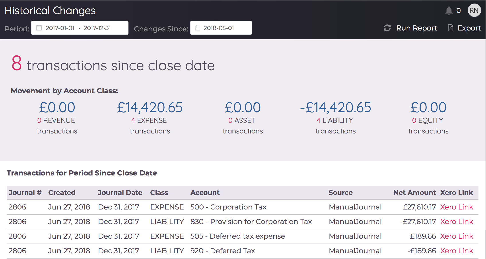

Have you ever had that uncomfortable feeling that something in a previous period has changed after you've reported it to
the board or to the tax authorities? All the accountants we know have run into this at some point. Everyone makes
mistakes, and it can be quite easy for someone with Advisor privileges in Xero to create a record with the wrong journal
date.

The tricky thing is tracking down these changes so they can be amended. Xavier allows you to identify exactly what was
changed and when within seconds. Simply input the historical reporting period that you want to check, and the close date
from which you expect no more transactions to have been logged for that period, and click *Run Report*.

Xavier queries the underlying journal transactions for the client, and looks for transactions that have a journal date
within the historical period, but a created date of __after__ the reporting close date.

You'll be able to jump straight to the offending transaction(s) in Xero from the results. And, in case you need to show
someone else where it all went wrong, you can always export the results to PDF.

## Regular Suppliers
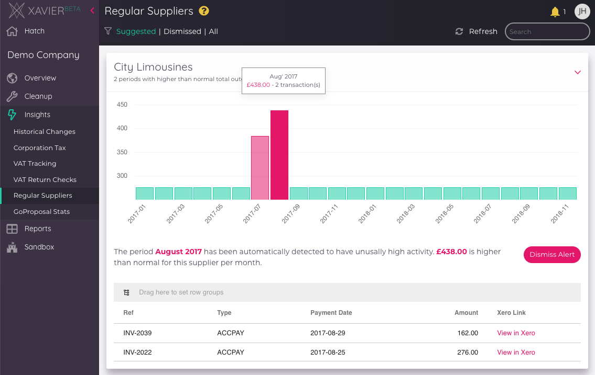

The Regular Suppliers insight is designed to analyse your client's payments to their suppliers over time and
automatically detect issues. Our AI will look for months where the total amount paid is higher than normal for
a supplier.

Clicking a supplier will show a chart of payments over time and highlight the periods where we have detected where there
may be an issue. Clicking on a bar in the chart will explain the issue that we have found and show a summary of payments to the
supplier in the chosen period. You may then choose to dismiss the alert or go through to Xero to investigate.

We are really excited about the possiblities here and we will be working hard to continue making this insight more powerful.

## VAT Return Checks
Xavier provides a set of checks that have been designed to quickly spot tax issues with respect to transaction data over
a given filing period. Simply enter in the date range and the minimum amounts (more on those below) and hit *Run Report*
to generate the checks. Expanding the card allows you to see these transactions, with a link directly to Xero to sort
them out.

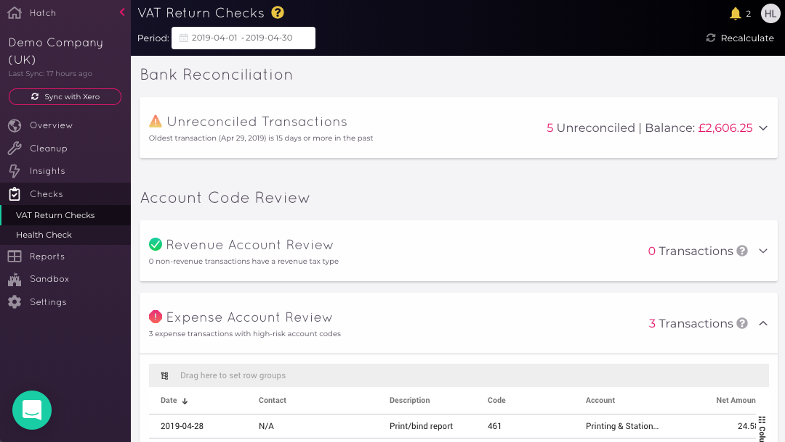

### Reconciliation Review
This uses the same logic as the [Unreconciled Transactions](/insights.html#unreconciled-transactions) insight to find
unreconciled transactions for the date range you have supplied.

### Revenue Account Review
This check finds transactions that don't have an Account Class of REVENUE, but have been assigned as revenue Tax Type of
OUTPUT2, RROUTPUT or ZERORATEDOUTPUT.

### Expense Account Review
This check finds expense transactions that have been assigned a Tax Type of INPUT2 (20% VAT on Expenses), with accounts
that have [Reporting Codes](https://central.xero.com/s/article/Report-codes-for-practices-using-report-templates) of 
EXP.ADM.ENT (Entertainment), EXP.ADM.PRI (Printing & Postage) or EXP.ADM.TRA (Travel International).

### Balance Sheet Review
This check finds ASSET, LIABILITY or EQUITY type transactions with a non-zero tax value, excluding Fixed Assets (account
type FIXED) and Reporting Codes of LIA.CUR.ACC (income in advance) or ASS.CUR.REC.PRE (prepayments).

### Zero-Rated Review
This check finds transactions with a tax type of ZERORATEDINPUT with a net value above the minimum amount set by you in
the report header (*Zero Rated Min*). The idea here is to ensure the client is claiming back VAT on as many high value
items as possible.

### No-VAT Review
This check finds transactions with a tax type of NONE with a net value above the minimum amount set by you in
the report header (*No VAT Min*).

### Multi-coded Contacts
The same as the [Multi-Coded Contacts](/insights.html#multi-coded-contacts) insight, but looking at contacts that
have transactions in the reporting period specified.

